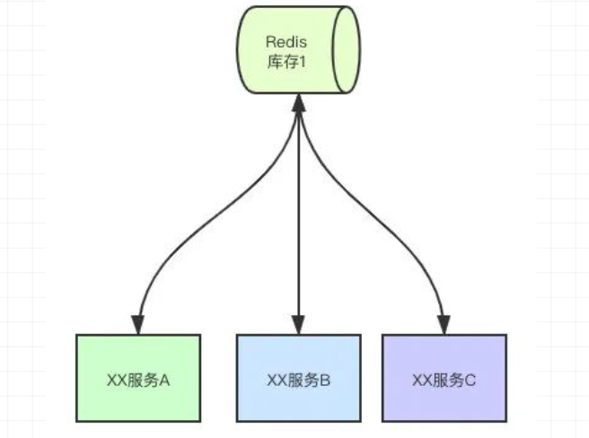
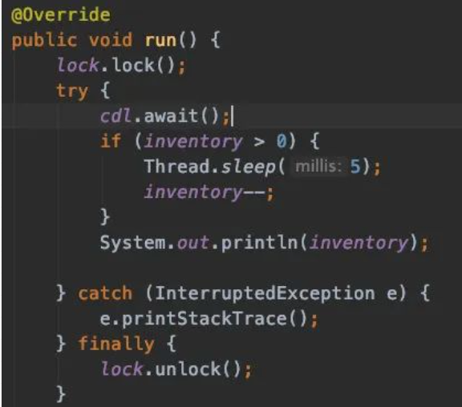
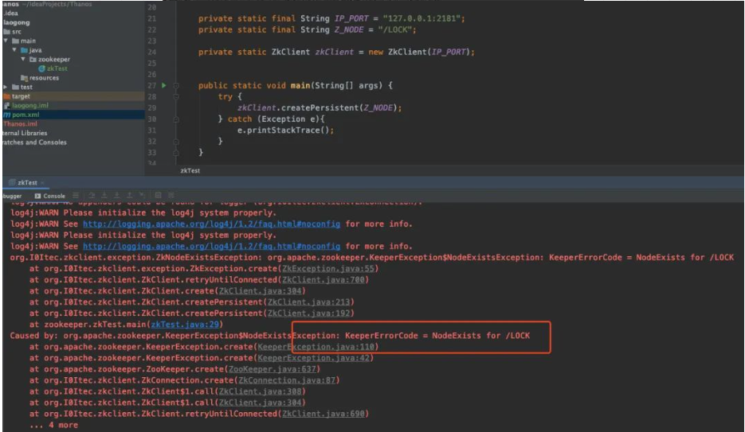
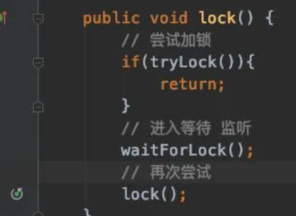
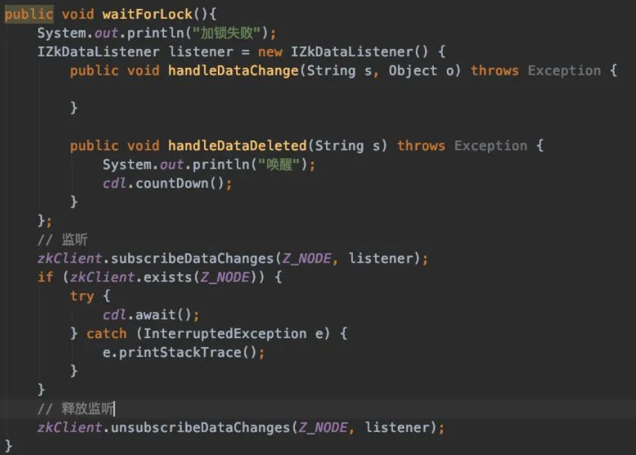
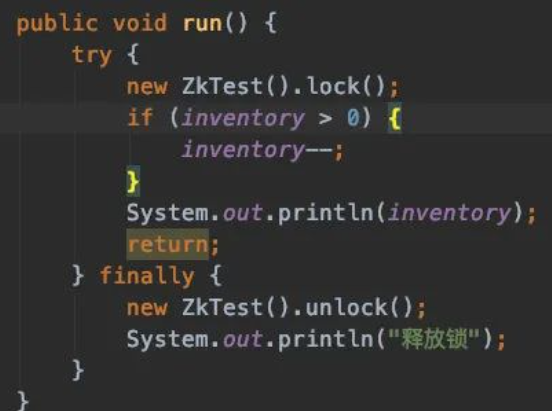
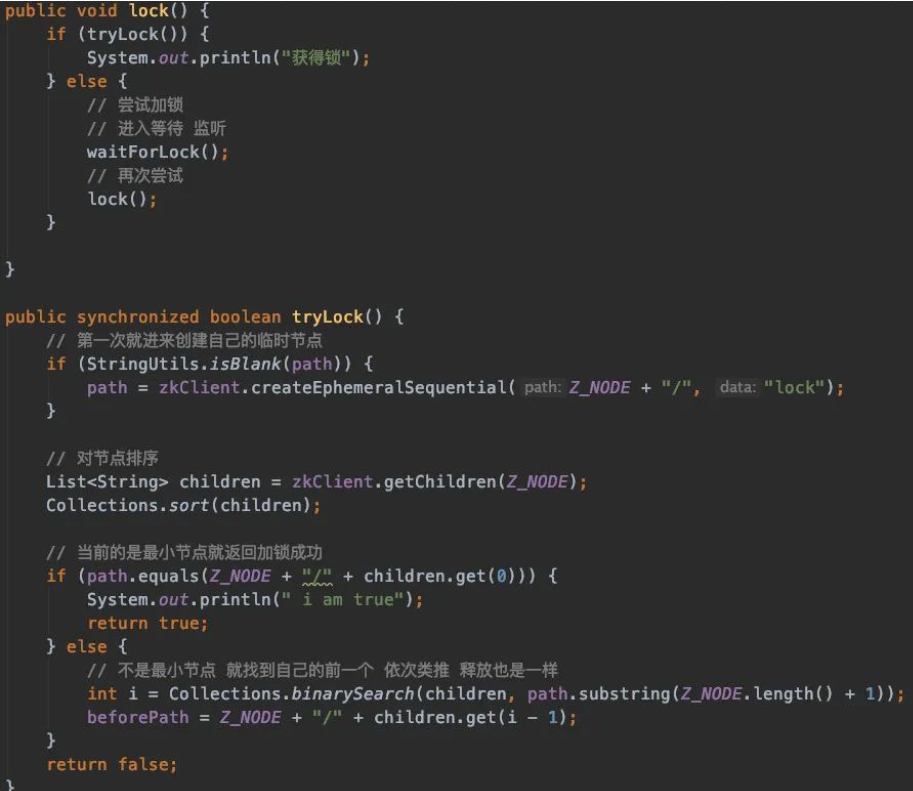
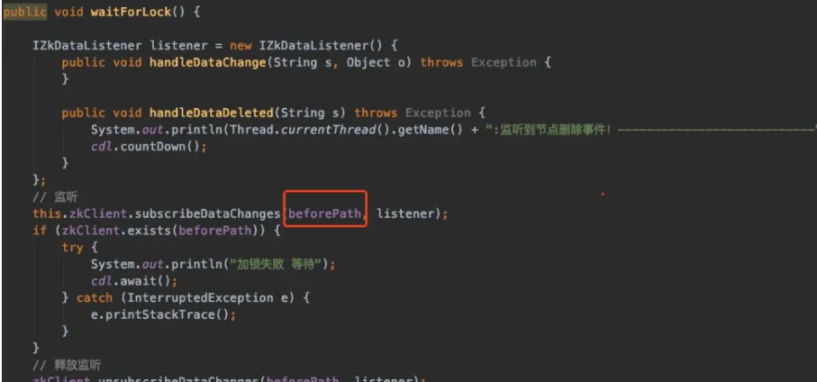

## 1. 开头

比如我们在做秒杀活动时，需要进行库存判断。

 

对于共享资源我们需要使用分布式锁来进行隔离资源。

## 2. 分布式锁原理

### 2.1. 线程同步机制

- 互斥

  互斥的机制，保证同一时间只有一个线程可以操作共享资源 synchronized，Lock等。

- 临界值

  让多线程串行话去访问资源

- 事件通知

  通过事件的通知去保证大家都有序访问共享资源

- 信号量

  多个任务同时访问，同时限制数量，比如发令枪CDL，Semaphore等

### 2.2. zookeeper使用场景

分布式锁实现主要以Zookeeper（以下简称zk）、Redis、MySQL

而zookeeper的使用场景。

- 服务注册与订阅（共用节点）
- 分布式通知（监听znode）
- 服务命名（znode特性）
- 数据订阅、发布（watcher）
- 分布式锁（临时节点）

### 2.3. zookeeper节点类型

- 持久化节点（zk断开节点还在）

  create /zknode

- 持久化顺序编号目录节点

  create -s /zknode

- 临时目录节点（客户端断开后节点就删除了）

  create -e /zknode

- 临时目录编号目录节点

  create -s -e /zknode

zk就是基于节点去实现各种分布式锁的

### 2.4. 分布式锁

#### 2.4.1. zk实现

 

zk节点有个唯一的特性，就是我们创建过这个节点了，你再创建zk是会报错的，那我们就利用一下他的唯一性去实现一下

 

释放锁

**删除节点咯，删了再通知其他的人过来加锁**

加锁我们知道创建节点就够了，但是你得实现一个阻塞的效果

死循环，递归不断去尝试，直到成功，一个伪装的阻塞效果

怎么知道前面删除节点了

 

 

 

#### 2.4.2.  存在问题

* 死锁

  创建临时节点即可

* 惊群效应

  所有服务都去监听一个节点的，节点的释放也会通知所有的服务器，有可能有上万台服务器。一个释放的消息，就好像一个牧羊犬进入了羊群，大家都四散而开，随时可能干掉机器，会占用服务资源，网络带宽等等。

  **临时顺序节点，可以顺利解决这个问题**

  全部监听一个节点问题很大，那我们就监听我们的前一个节点，因为是顺序的，很容易找到自己的前后

   

  和之前监听一个永久节点的区别就在于，这里每个节点只监听了自己的前一个节点，释放当然也是一个个释放下去，就不会出现羊群效应了

   

  Zk性能上可能并没有缓存服务那么高。

  因为每次在创建锁和释放锁的过程中，都要动态创建、销毁瞬时节点来实现锁功能。

  ZK中创建和删除节点只能通过Leader服务器来执行，然后将数据同步到所有的Follower机器上

* 并发问题

  

## 3. 总结

* zk通过临时节点，解决掉了**死锁**的问题，一旦客户端获取到锁之后突然挂掉（Session连接断开），那么这个临时节点就会自动删除掉，其他客户端自动获取锁。

* zk通过节点排队监听的机制，也实现了**阻塞**的原理，其实就是个递归在那无限等待最小节点释放的过程。

  也可以实现锁的**可重入**，但是也很好实现，可以带上线程信息就可以了，或者机器信息这样的唯一标识，获取的时候判断一下。

* zk的集群也是**高可用**的，只要半数以上的或者，就可以对外提供服务了。